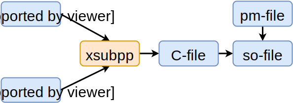
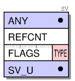
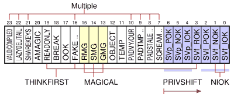
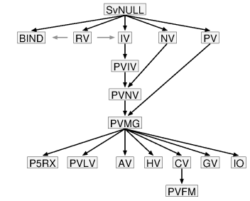
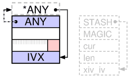

class:firstpage, title
# Программирование на Perl

## Ускоряем перл (XS)

---

class:note_and_mark, title

# Отметьтесь на портале!
 
---

# Зачем?

- оптимизация производительности
  - сокращаем потребление памяти
  - сокращаем потребление CPU
- увеличение скорости разработки
  - использование готового кода и библиотек
  - некоторые задачи проще решать на C
  - в Perl есть регулярные выражения и не только

---

# Зачем?
Perl vs C
```perl
$ts = time();

for($i = 0; $i < 1e7; $i++) { $sum += $i; }

say "Perl: " . (time() - $ts);
$ts = time(); $sum = mysum();
say "C:    " . (time() - $ts);

__END__
__C__
SV * mysum() {
	unsigned long sum = 0;
	for(unsigned i = 0; i < 1e7; i++) sum += i;
	newSViv(sum);
}
```

---

# Зачем?

<div style="height:1em;"></div>

## Кто быстрее? На сколько?

---

# Зачем?

<div style="height:1em;"></div>

## Кто быстрее? На сколько?
```html
Perl: 0.613094091415405
C:    0.00823593139648438
```
C в 75 раз быстрее!

---

layout:false

# Содержание

1. **Генерация XS модулей**
1. Макропроцессор
1. Типы данных изнутри
1. Работа со стеком
1. Typemaps
1. Встраивание Perl (perlembed)
1. Альтернативы

---

layout: true
# Генерация XS модулей

---

<div style="height:1em;"></div>

```html
$ perl -V:make

make='make';

$ h2xs -n Local::Base58::XS -b 5.18.0
```
C::Scan - модуль для парсинга хеадер-файла для генерации xsubs.

```html
$ h2xs -n Local::Base58::XS -O -x "include/base58.h"
```
.footnote[
См. разделы [perlxstut](http://perldoc.perl.org/perlxstut.html) и
[perlnewmod](http://perldoc.perl.org/perlnewmod.html) в perldoc
]

???

Компиляция модулей должна происходить точно так же как и собирался перл. Что бы узнать, какой мейкер доступен в вашей среде, нужно выполнить первую команду.
А что бы разработчику на вспоминать и не создавать вручную всю структуру каталогов и файлов, можно воспользоваться утилитой h2xs

Так же эта утилита позволяет не только создавать пустые модули, но ее можно использовать для создания скилета для уже существующей библиотеки на С если у вас есть необходимый хеадер файл.

---

Базовый набор файлов, необходимых для создания модуля.

```html
$ h2xs -n Local::Base58::XS -b 5.18.0
Writing Local-Base58-XS/ppport.h
Writing Local-Base58-XS/lib/local/Base58/XS.pm
Writing Local-Base58-XS/XS.xs
Writing Local-Base58-XS/fallback/const-c.inc
Writing Local-Base58-XS/fallback/const-xs.inc
Writing Local-Base58-XS/Makefile.PL
Writing Local-Base58-XS/README
Writing Local-Base58-XS/t/local-Base58-XS.t
Writing Local-Base58-XS/Changes
Writing Local-Base58-XS/MANIFEST

```

.footnote[
См. разделы [perlxstut](http://perldoc.perl.org/perlxstut.html) и
[perlnewmod](http://perldoc.perl.org/perlnewmod.html) в perldoc
]

???

- ppport.h
- XS.pm
- XS.xs
- const-{c,xs}.inc
- Makefile.PL
- README
- local-Base58-XS.t
- Changes
- MANIFEST

---

Сборка и тестирование модуля

```html
$ perl Makefile.PL
$ make
$ make test

t/local-Base58-XS.t .. ok
All tests successful.
Files=1, Tests=1,  0 wallclock secs ( 0.04 usr  0.⤶
00 sys +  0.03 cusr  0.00 csys =  0.07 CPU)
Result: PASS


$ make install
```

.footnote[
См. разделы [perlxstut](http://perldoc.perl.org/perlxstut.html) и
[perlnewmod](http://perldoc.perl.org/perlnewmod.html) в perldoc
]

---

layout:false

# Содержание

1. Генерация XS модулей
1. **Макропроцессор**
1. Типы данных изнутри
1. Работа со стеком
1. Typemaps
1. Встраивание Perl (perlembed)
1. Альтернативы

---

layout: true
# Макропроцессор

---


XS - набор макросов

xsubpp - компилятор который собирает С код из макросов

TYPEMAP - правила преобразования типов данных

.center[.normal-width[]]

.footnote[
См. разделы [perlxstut](http://perldoc.perl.org/perlxstut.html) и
[xsubpp](http://perldoc.perl.org/xsubpp.html) в perldoc
]

???

```txt
 __________
| TYPEMAP  |___
|__________|   \      ___________       _________
                \____|  XSUBPP   |_____| C-File  |
                /    |___________|     |_________|
 __________    /                            ^
|  XS-file |__/                         ____|____
|__________|                           | PM-file |
                                       |_________|
```
xsub - функции написанные в xs-модуле

---

layout:false

# Содержание

1. Генерация XS модулей
1. Макропроцессор
1. **Типы данных изнутри**
1. Работа со стеком
1. Typemaps
1. Встраивание Perl (perlembed)
1. Альтернативы

---

layout: true
# Типы данных изнутри

---

- SV  Scalar Value
- AV  Array Value
- HV  Hash Value

.floatright[]

- SV:
 - IV - signed integer value
 - UV - unsigned integer value
 - NV - double value
 - PV - pointer value
 - <span style="opacity: 0.5">RV - references value</span>

.center[.normal-width[]] 

.footnote[
См. [illguts](http://cpansearch.perl.org/src/RURBAN/illguts-0.49/index-18.html)
]

???

 - NULL - PL\_sv\_\{undef|yes|no\}


```c
struct STRUCT_SV {		/* struct sv { */
    _SV_HEAD(void*);
    _SV_HEAD_UNION;
}


#define _SV_HEAD(ptrtype) \
    ptrtype	sv_any;		/* pointer to body */	\
    U32		sv_refcnt;	/* how many references to us */	\
    U32		sv_flags	/* what we are */

#define _SV_HEAD_UNION \
    union {				\
	char*   svu_pv;		/* pointer to malloced string */	\
	IV      svu_iv;			\
	UV      svu_uv;			\
	_NV_BODYLESS_UNION		\
	SV*     svu_rv;		/* pointer to another SV */		\
	struct regexp* svu_rx;		\
	SV**    svu_array;		\
	HE**	svu_hash;		\
	GP*	svu_gp;			\
	PerlIO *svu_fp;			\
    }	sv_u
```

---

<div style="height:1em;"></div>

.center[.normal-width[]]
.center[SvIV]
.center[.normal-width[]]


.footnote[
См. [illguts](http://cpansearch.perl.org/src/RURBAN/illguts-0.49/index-18.html)
]

???

In addition to the simple type names already mentioned, the following names are found in the hierarchy figure:
    An PVIV value can hold a string and an integer value.
    An PVNV value can hold a string, an integer and a double value.
    The PVMG is used when magic is attached or the value is blessed.
    The PVLV represents a LValue object.
    RV is now a seperate scalar of type SVt_IV.
    CV is a code value, which represents a perl function/subroutine/closure or contains a pointer to an XSUB.
    GV is a glob value and IO contains pointers to open files and directories and various state information about these.
    The PVFM is used to hold information on forms.
    P5RX was formerly called PVBM for Boyer-Moore (match information), but contains now regex information.
    BIND was a unused placeholder for read-only aliases or VIEW. (#29544, #29642)
    INVLIST is an CORE internal inversion list object only, used for faster utf8 matching, since 5.19.2. Same layout as a PV.

---

SvPV

.center[.normal-width[]]

SvOOK

.center[.normal-width[]]

.footnote[
См. [illguts](http://cpansearch.perl.org/src/RURBAN/illguts-0.49/index-18.html)
]

---

SvRV

.center[.normal-width[]]

SvAV

.center[.normal-width[]]

.footnote[
См. [illguts](http://cpansearch.perl.org/src/RURBAN/illguts-0.49/index-18.html)
]

---

SvHV

.center[.normal-width[]]

.footnote[
См. [illguts](http://cpansearch.perl.org/src/RURBAN/illguts-0.49/index-18.html)
]

---

SvPVMG

.center[.normal-width[]]

.footnote[
См. [illguts](http://cpansearch.perl.org/src/RURBAN/illguts-0.49/index-18.html)
]

---

*Создание переменных*

```perlxs
SV* newSV(0);
SV* newSViv(IV);
SV* newSVuv(UV);
SV* newSVnv(double);
SV* newSVpv(const char*);
SV* newSVpvn(const char*, STRLEN);
SV* newSVpvf(const char*, ...);
SV* newSVsv(SV*);
```

.footnote[
См. разделы [perlxstut](http://perldoc.perl.org/perlxstut.html),
[perlxs](http://perldoc.perl.org/perlxs.html) и
[perlapi](http://perldoc.perl.org/perlapi.html)
в perldoc
]

---

*Установка значения переменной*

```perlxs
void  sv_setiv(SV*, IV);
void  sv_setuv(SV*, UV);
void  sv_setnv(SV*, double);
void  sv_setpv(SV*, const char*);
void  sv_setpvn(SV*, const char*, STRLEN)
void  sv_setpvf(SV*, const char*, ...); //sprintf
void  sv_setsv(SV*, SV*);
```

.footnote[
См. разделы [perlxstut](http://perldoc.perl.org/perlxstut.html),
[perlxs](http://perldoc.perl.org/perlxs.html) и
[perlapi](http://perldoc.perl.org/perlapi.html)
в perldoc
]

---

*Получение значения переменной*

```perlxs
SvIV(SV*)
SvUV(SV*)
SvNV(SV*)
SvPV(SV*, STRLEN len) //возвращается длина строки
SvPV_nolen(SV*)
```

*Проверка типа SV-шки*

```perlxs
SvOK(SV*)
SvIOK(SV*)
SvNOK(SV*)
SvPOK(SV*)
SvOK(SV*)
SvTRUE(SV*)
```

.footnote[
См. разделы [perlxstut](http://perldoc.perl.org/perlxstut.html),
[perlxs](http://perldoc.perl.org/perlxs.html) и
[perlapi](http://perldoc.perl.org/perlapi.html)
в perldoc
]

---

*Работа со строками*

```c
SvCUR(SV*) - длина
SvCUR_set(SV*, I32 val)
SvGROW(sv, needlen + 1)
SvUTF8_off(sv);

SvEND(SV*) // a pointer to last character + 1

sv_setpvn(sv, "", 0);

s = SvGROW(sv, needlen + 1);
// remember trailing NUL

s[newlen] = '\0';
SvCUR_set(sv, newlen);
```

.footnote[
См. разделы [perlxstut](http://perldoc.perl.org/perlxstut.html),
[perlxs](http://perldoc.perl.org/perlxs.html) и
[perlapi](http://perldoc.perl.org/perlapi.html)
в perldoc
]

---

layout:false

# Содержание

1. Генерация XS модулей
1. Макропроцессор
1. Типы данных изнутри
1. **Работа со стеком**
1. Typemaps
1. Встраивание Perl (perlembed)
1. Альтернативы

---

layout: true
# Работа со стеком

---

*Вызов XSUB из перл*

Получение переменной из стека
```perlxs
ST(n) // n < items

```

Установка переменной в стек

```perlxs
EXTEND(SP, num);
PUSHs(SV*);
```

```perlxs
XPUSHs(SV*);
```

.footnote[
См. раздел [perlguts](http://perldoc.perl.org/perlguts.html)
в perldoc
]

---

perlxs.xs

```c
#define PERL_NO_GET_CONTEXT
#include "EXTERN.h"
#include "perl.h"
#include "XSUB.h"
#include "ppport.h"
#include "const-c.inc"

MODULE = local::perlxs PACKAGE = local::perlxs
INCLUDE: const-xs.inc

```

.footnote[
См. разделы
[perlxs](http://perldoc.perl.org/perlxs.html) и
[perlguts](http://perldoc.perl.org/perlguts.html)
в perldoc
]

---

*CODE + OUTPUT = dSP + XPUSHs + ...*

```c
#include <math.h>

double distance_point(x1,y1,x2,y2)
    double x1
    double y1
    double x2
    double y2

    CODE:
    double ret;
    ret = sqrt( pow(x1-x2, 2) + pow(y1-y2, 2) );
    RETVAL = ret;

    OUTPUT:
    RETVAL
```

.footnote[
См. разделы
[perlxs](http://perldoc.perl.org/perlxs.html) и
[perlguts](http://perldoc.perl.org/perlguts.html)
в perldoc
]

???
```c
#define dSP		SV **sp = PL_stack_sp
#define XPUSHs(s)	STMT_START { EXTEND(sp,1); *++sp = (s); } STMT_END
```
---

*PPCODE*

```c
#include <math.h>

void distance_point(x1,y1,x2,y2)
    double x1
    double y1
    double x2
    double y2

    PPCODE:
    double ret;
    ret = sqrt( pow(x1-x2, 2) + pow(y1-y2, 2) );
    PUSHn((double)ret);
```

.footnote[
См. разделы
[perlxs](http://perldoc.perl.org/perlxs.html) и
[perlguts](http://perldoc.perl.org/perlguts.html)
в perldoc
]

???

```
#define PUSHs(s)	(*++sp = (s))
#define PUSHn(n)	STMT_START { sv_setnv(TARG, (NV)(n)); PUSHTARG; } STMT_END
```

---

<div style="height:1em;"></div>

```c
void distance_ext_point(x1,y1,x2,y2)
    double x1
    double y1
    double x2
    double y2

    PPCODE:
    double dx = abs(x1-x2);
    double dy = abs(y1-y2);
    double dist = sqrt( pow(dx, 2) + pow(dy, 2) );

    PUSHs(sv_2mortal(newSVnv(dist)));
    PUSHs(sv_2mortal(newSVnv(dx)));
    PUSHs(sv_2mortal(newSVnv(dy)));
```

.footnote[
См. разделы
[perlxs](http://perldoc.perl.org/perlxs.html) и
[perlguts](http://perldoc.perl.org/perlguts.html)
в perldoc
]

---

.center[.normal-width[]]

.footnote[
См. раздел
[perlinterp](http://perldoc.perl.org/perlinterp.html)
в perldoc
]

???

The mark stack keeps bookmarks to locations in the argument stack usable by each function.

---

<div style="height:1em;"></div>

```c
dXSARGS; //dSP and dMARK and dITEMS
if (items != 4) croak_xs_usage(cv, "x1,y1,x2,y2");
double        x1 = (double)SvNV(ST(0));
double        y1 = (double)SvNV(ST(1));
double        x2 = (double)SvNV(ST(2));
double        y2 = (double)SvNV(ST(3));
double dx = abs(x1-x2);
double dy = abs(y1-y2);
double dist = sqrt( pow(dx, 2) + pow(dy, 2) );
SP -= items;
PUSHs(sv_2mortal(newSVnv(dist)));
PUSHs(sv_2mortal(newSVnv(dx)));
PUSHs(sv_2mortal(newSVnv(dy)));
PUTBACK;
return;
```

.footnote[
см. раздел
[perlinterp](http://perldoc.perl.org/perlinterp.html)
в perldoc
]

???

The mark stack keeps bookmarks to locations in the argument stack usable by each function.

```c
#define dSP		SV **sp = PL_stack_sp
#define dMARK		SV **mark = PL_stack_base + POPMARK
#define dITEMS I32 items = (I32)(SP - MARK)
#define PUTBACK		PL_stack_sp = sp
#define PUSHs(s)	(*++sp = (s))
```

---

.center[.normal-width[]] 

.footnote[
см. раздел
[perlinterp](http://perldoc.perl.org/perlinterp.html)
в perldoc
]

---

*mortal переменные*
```c
int SvREFCNT(SV* sv);
SV* SvREFCNT_inc(SV* sv);
void SvREFCNT_dec(SV* sv);
SV* newRV_noinc(SV *const sv);

SV*  sv_newmortal()
SV*  sv_2mortal(SV*)
SV*  sv_mortalcopy(SV*)

ENTER; SAVETMPS;

sv_2mortal(newSVnv(sqrt(pow(x1-x2,2)+pow(y1-y2,2))))

SV *tmp = sv_newmortal(); sv_setiv(tmp, an_integer);

FREETMPS; LEAVE;
```

.footnote[
см. раздел
[perlinterp](http://perldoc.perl.org/perlinterp.html)
в perldoc
]

---

*Создание объекта*

```c
ST(0) = sv_2mortal(
    sv_bless(
        newRV_noinc(
            newSViv(
                PTR2IV( self )
            )
        ),
        gv_stashpv(
            SvPV_nolen( ST(0) ),
            TRUE
        )
    )
);

```

.footnote[
см. раздел
[perlapi](http://perldoc.perl.org/perlapi.html)
в perldoc
]

---

*Вызов перл функции из XSUB*

```perl
sub get_points { return 1,1,1,3; }
```

```c
double distance_call_point()
  PPCODE:
    int count;
    double x1, y1, x2, y2;
    ENTER; SAVETMPS; PUSHMARK(SP);
    count = call_pv("local::perlxs::get_points", 
                    G_ARRAY|G_NOARGS);
    SPAGAIN;
    if (count!=4) croak("call get_points trouble");
    x1 = POPn; y1 = POPn; x2 = POPn; y2 = POPn;
    double dist = sqrt(pow(x1-x2,2)+pow(y1-y2,2));
    FREETMPS; LEAVE;
    PUSHs(sv_2mortal(newSVnv(dist)));
```

---

*Вызов перл функции с аргументами*

```perl
sub get_points {
    if( !$_[0] )      { return 1,1,1,3 }
    elsif($_[0] == 1) { return 1,1 }
    elsif($_[0] == 2) { return 1,3 }
}
```

---

*Вызов перл функции с аргументами*

```c
double distance_call_arg_point()
 PPCODE:
  int count; double x1, y1, x2, y2;
  ENTER; SAVETMPS; PUSHMARK(SP);
  XPUSHs(sv_2mortal(newSViv(1))); PUTBACK;
  count = call_pv("perlxs::get_points", G_ARRAY);
  SPAGAIN;
  if (count!=2) croak("call get_points trouble\n");
  x1 = POPn; y1 = POPn;PUSHMARK(SP);
  XPUSHs(sv_2mortal(newSViv(2)));PUTBACK;
  count = call_pv("perlxs::get_points", G_ARRAY);
  SPAGAIN;
  if (count!=2) croak("call get_points trouble\n");
  x2 = POPn; y2 = POPn;
  double dist=sqrt(pow(x1-x2,2)+pow(y1-y2,2));
  FREETMPS; LEAVE;
  PUSHs(sv_2mortal(newSVnv(dist)));
```

---

layout:false

# Содержание

1. Генерация XS модулей
1. Макропроцессор
1. Типы данных изнутри
1. Работа со стеком
1. **Typemaps**
1. Встраивание Perl (perlembed)
1. Альтернативы

---

layout: true
# Typemaps

---

<div style="height:1em;"></div>

```typemap
TYPEMAP
int                     T_IV
unsigned                T_IV
char                    T_CHAR
unsigned char           T_U_CHAR
char *                  T_PV
unsigned char *         T_PV
AV *                    T_AVREF
HV *                    T_HVREF
CV *                    T_CVREF
...
INPUT
T_PV
    $var = ($type)SvPV_nolen($arg)
OUTPUT
T_PV
    sv_setpv((SV*)$arg, $var);
```


.footnote[
см. раздел
[perlxstypemap](http://perldoc.perl.org/perlxstypemap.html)
в perldoc
]

---

<div style="height:1em;"></div>

```c
double distance_pointobj(r_point1, r_point2)
  SV *r_point1
  SV *r_point2
  PPCODE:
  double x1,y1,x2,y2;
  SV **_x1,**_y1,**_x2,**_y2,*_point1,*_point2;
  HV *point1, *point2;
  if (!(SvOK(r_point1) 
     && SvROK(r_point1) 
     && SvOK(r_point2) 
     && SvROK(r_point2)))
      croak("Point must be a hashref");
  _point1 = SvRV(r_point1); 
  _point2 = SvRV(r_point2);
  if (SvTYPE(_point1)!=SVt_PVHV 
     || SvTYPE(_point2) != SVt_PVHV)
      croak("Point must be a hashref");
```

---

<div style="height:1em;"></div>

```c
  point1 = (HV*)_point1;
  point2 = (HV*)_point2;
  if (!(hv_exists(point1, "x", 1) 
     && hv_exists(point2, "x", 1) 
     && hv_exists(point1, "y", 1) 
     && hv_exists(point2, "y", 1)))
      croak("Point mush contain x and y keys");
  _x1 = hv_fetch(point1, "x", 1, 0); 
  _y1 = hv_fetch(point1, "y", 1, 0);
  _x2 = hv_fetch(point2, "x", 1, 0); 
  _y2 = hv_fetch(point2, "y", 1, 0);
  if (!(_x1 && _x2 && _y1 && _y2))
     croak("Non allow NULL in x and y coords");
  x1 = SvNV(*_x1); x2 = SvNV(*_x2);
  y1 = SvNV(*_y1); y2 = SvNV(*_y2);
  PUSHs(sv_2mortal(newSVnv(
    sqrt(pow(x1-x2,2) + pow(y1-y2,2))
  )));
```

---

<div style="height:1em;"></div>

```c
typedef struct { double x, y; } GEOM_POINT;
```

```c
TYPEMAP
WORD                    T_IV
LONG                    T_IV
int                     T_IV
unsigned                T_IV
char                    T_CHAR
unsigned char           T_U_CHAR
char *                  T_PV
unsigned char *         T_PV
AV *                    T_AVREF
HV *                    T_HVREF
CV *                    T_CVREF
...
GEOM_POINT*             T_HVREF

```

.footnote[
см. раздел
[perlxstypemap](http://perldoc.perl.org/perlxstypemap.html)
в perldoc
]

---

<div style="height:1em;"></div>

```c
INPUT
T_HVREF
  {
  double typemap_x, typemap_y;
  if (!SvOK($arg) || !SvROK($arg)) croak(\"Ref?\");
  HV *tm__p = SvRV($arg);
  if (SvTYPE(tm__p)!=SVt_PVHV) croak(\"Not hash\");
  SV* tm_p = (HV*)tm__p;
  if (!hv_exists(tm_p,\"x\",1)) croak(\"No 'x'\");
  if (!hv_exists(tm_p,\"y\",1)) croak(\"No 'y'\");
  SV **tm__x=hv_fetch(tm_p,\"x\",1,0);
  SV **tm__y=hv_fetch(tm_p,\"y\",1,0);
  if(!tm__x || !tm__y) croak(\"x and y required\");
  typemap_x=SvNV(*tm__x); typemap_y=SvNV(*tm__y);
  $type pt = malloc(sizeof(GEOM_POINT));
  pt->x = typemap_x; pt->y = typemap_y;
  $var = ($type)pt;
  }
```

---

<div style="height:1em;"></div>

```c
OUTPUT
T_HVREF
  croak(\"Unimplemented output $type\");

```

```c
double distance_pointstruct(point1, point2)
    GEOM_POINT *point1
    GEOM_POINT *point2
    CODE:
    double ret;
    ret = sqrt(pow(point1->x-point2->x,2) 
              +pow(point1->y-point2->y,2));
    free(point1);
    free(point2);
    RETVAL = ret;
    OUTPUT:
    RETVAL
```

---

<div style="height:1em;"></div>

```c
TYPEMAP
HV* T_HVREF_3D
GEOM_POINT_3D* T_HVREF_3D

INPUT
T_HVREF_3D
  {
  double typemap_x, typemap_y, typemap_z;
  if (!(SvOK($arg) && SvROK($arg)))
    croak(\"Point must be a hashref\");
  SV *typemap__point = SvRV($arg);
  if (SvTYPE(typemap__point) != SVt_PVHV )
    croak(\"Point must be a hashref\");
  HV *typemap_point = (HV*)typemap__point;
  if (!(hv_exists(typemap_point,\"x\",1) 
     && hv_exists(typemap_point,\"y\",1) 
     && hv_exists(typemap_point,\"z\",1)))
       croak(\"x, y, z keys is required\");
```

---

<div style="height:1em;"></div>

``` c
  SV **tm__x=hv_fetch(typemap_point,\"x\",1,0);
  SV **tm__y=hv_fetch(typemap_point,\"y\",1,0);
  SV **tm__z=hv_fetch(typemap_point,\"z\",1,0);
  if(!(tm__x && tm__y && tm__z))
    croak(\"Non allow NULL in x or y or z\");
  typemap_x = SvNV(*tm__x);
  typemap_y = SvNV(*tm__y);
  typemap_z = SvNV(*tm__z);
  $type pt = malloc(sizeof(GEOM_POINT_3D));
  pt->x = typemap_x;
  pt->y = typemap_y;
  pt->z = typemap_z;
  $var = ($type)pt;
  }
```

---

layout: false
# Содержание

1. Генерация XS модулей
1. Макропроцессор
1. Типы данных изнутри
1. Работа со стеком
1. Typemaps
1. **Встраивание Perl (perlembed)**
1. Альтернативы

---

layout: true
# Встраивание Perl (perlembed)

---

*Интерпретатор Perl*

```c
#include <EXTERN.h>
#include <perl.h>
static PerlInterpreter *my_perl;
int main(int argc, char **argv, char **env)
{
  PERL_SYS_INIT3(&argc,&argv,&env);
  my_perl = perl_alloc();
  perl_construct(my_perl);
  PL_exit_flags |= PERL_EXIT_DESTRUCT_END;
  perl_parse(my_perl,NULL,argc,argv,(char **)NULL);
  perl_run(my_perl);
  perl_destruct(my_perl);
  perl_free(my_perl);
  PERL_SYS_TERM();
}
```

---

*Интерпретатор Perl*

```bash
perl -MExtUtils::Embed -e ccopts -e ldopts
```

```bash
cc -o interp interp.c `perl -MExtUtils::Embed \
   -e ccopts -e ldopts`
```

---

Что хотим использовать:
```html
ABSTRACT_TEXT
<!--[FUNC_NAME(PARAM1,PARAM2)]-->
ABSTRACT_TEXT
<!--[VAR_NAME]-->
ABSTRACT_TEXT
```

Например:

```html
<--[set_var(str,world)]--> Hello 
<!--[html_escape(str)]-->!!!
<--[set_var(num1,10)]-->
<--[incr_var(num1,15)]-->
Sum: <--[num1]-->
```

---

<div style="height:1em;"></div>

```c
int main (int argc, char **argv, char **env) {
  ...
  char *perl_argv[]={"",module,include_dir,"-e0"};
  PERL_SYS_INIT3(&argc,&argv,&env);
  my_perl = perl_alloc();
  perl_construct( my_perl );
  exitstatus=perl_parse(my_perl,NULL,4,perl_argv,
                         (char**)NULL);
  if(exitstatus){
    exit(exitstatus);
  }
  perl_run(my_perl);
  ...
  call_func(func_name, num_param, args);
  print_var(var_in_pkg, str);
  ...
}
```

---

<div style="height:1em;"></div>

```c
static void
call_func(char *func_name, int argv, char **argc){
  int count, f;
  dSP; ENTER; SAVETMPS; PUSHMARK(SP);
  for(f=0;f<argv;f++){
    XPUSHs(sv_2mortal(newSVpv(argc[f],
                      strlen(argc[f])))); }
  PUTBACK;
  count = call_pv(func_name, G_SCALAR|G_EVAL); 
  SPAGAIN; PUTBACK;
  if (SvTRUE(ERRSV)){error_tmpl(SvPV_nolen(ERRSV);}
  else{
    if (count != 1)
      error_tmpl("More then 1 params returning");
    printf ("%s", POPp);
  }
  FREETMPS; LEAVE;
}
```

---

<div style="height:1em;"></div>

```c
static void
print_var(char *var_name, char *var) {
  HV *h_var;
  h_var = get_hv(var_name, 0);
  if(!h_var) error_tmpl("Vars hash not exist");
  SV **sr_var=hv_fetch(h_var, var, strlen(var), 0);
  if(!sr_var) error_tmpl("Var not exist");
  if(SvTYPE(*sr_var) == SVt_IV)
    printf( "%li", SvIV(*sr_var));
  else if(SvTYPE(*sr_var)==SVt_NV){
    printf("%f", SvNV(*sr_var));
  }
  else if(SvTYPE(*sr_var) == SVt_PV){
    printf("%s", SvPV_nolen(*sr_var));
  }
  else{ error_tmpl("Incompatible type of var"); }
}
```

---

layout: false
# Содержание

1. Генерация XS модулей
1. Макропроцессор
1. Типы данных изнутри
1. Работа со стеком
1. Typemaps
1. Встраивание Perl (perlembed)
1. **Альтернативы**

---

# Inline::C

<div style="height:1em;"></div>

```perl
use Inline C => DATA => libs => '-lz';

say CRC32("1234");
say unpack('H*', pack('N', CRC32("1234")));

__END__
__C__
#include <zlib.h>

SV * CRC32(SV * sv_buf) {
	STRLEN len;
	unsigned char * buf;
	buf = SvPV(sv_buf, len);
	newSViv(crc32(NULL, buf, len));
}
```

---

# FFI::Raw

<div style="height:1em;"></div>

```perl
use FFI::Raw;

# ZEXTERN uLong ZEXPORT
# crc32 OF((uLong crc, const Bytef *buf, uInt len));
my $crc32 = FFI::Raw->new("libz.so", "crc32",
	FFI::Raw::uint64, # uLong
	FFI::Raw::uint64, # uLong
	FFI::Raw::str,    # const Bytef *
	FFI::Raw::uint    # uInt
);
say unpack('H*',
  pack('N', $crc32->call(0, "1234", 4)));
```

---
layout: false
# Домашнее задание

Написать xs-модуль Local::Stats для подсчета статистики.
- модуль имеет три метода new, add, stat
- конструктор (new) принимает coderef
- метод add принимает два аргумента — имя метрики и её значение. Если метрика не встречалась ранее, то должна быть вызвана процедура по coderef для получения настроек метрики. Настройки метрики — список (возможно пустой), содержащий строки "avg", "cnt", "max", "min", "sum"
- Метод stat возвращает ссылку на хэш со статистикой для метрик с непустым конфигом и обнуляет статистику
```perl
{
  m1 => { avg => 1, sum => 5, max => 2 },
  m2 => { cnt => 100 }
}
```
---

class:lastpage title

# Спасибо за внимание!

## Оставьте отзыв

.teacher[]
